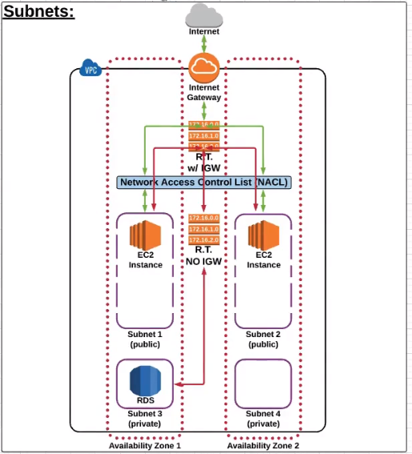

AWS Global Infrastructure 
Regions = agroup of AWS resource, comprised of multiple of AZ 
AZ Availabiliy Zones 
------
VPC Virtual Private Cloud

A default VPC including:
- IGW internet gateway
- A route table
- A network access control list
- Subnets to provision AWS resource in (e.g. EC2 instance)

------

 - IGW 
 - RouteTables 
You cannot delete RT if it has dependencies 

 - NACL Network Access Control List 
 (1) Rules are evaluated from lowest to highest based on "rule #" 
 (2) The first rule found that applies to the traffic type is immediatly applied, regardless of any rules that come after it (have a higher "rule #"). 
 (3) The 'default' NACL allows all traffic to the default subnets. 
 (4) Any new NACLs you create DENY all traffic by default. 
 (5) A subnet can only be associated with ONE NACL as a lime. 
 (6) An NACL allows or denies traffic from entering a subnet. Once inside the subnet, other AWS resources (i.e. EC2 instances) may have an additional layer of security (security groups). 

 

---

Subnet: 
When you create a VPC, it spans all of the Availability Zones in the region. After creating a VPC, **you can add one or more subnets in each Availablity Zone**. Each subnet **must reside entirely** within one Availability Zone and **cannot span zones**.

Public Subnet has a route to the Internet.
Private Subnet DO NOT HAVE a route to the Internet.

CIDR https://en.wikipedia.org/wiki/Classless_Inter-Domain_Routing

In the following network configuration

 
 
 - VPC CIDR 172.31.0.0/16
 - IGW igw-dab7dbbe Attached to VPC
 - 2 Router Tables 
     "Default" routes IGW attached 
 
 Destination   | Target   
 ------------- | ----------
 172.31.0.0/16 | local    
 0.0.0.0/0     | igw-dab7dbbe
 
     "EssentialsRT" routes 
 
 Destination   | Target   
 ------------- | ----------
 172.31.0.0/16 | local    
      
  - 4 Subnets
  
 Name   | CIDR  | RT |  AZ
 ------------- | ---------- | ------------- | ----------
Public Subnet 1 | 172.31.48.0/16 | Default | AZ1
Public Subnet 2 | 172.31.0.0/16 | Default | AZ2
Private Subnet 3 | 172.31.16.0/16 | EssentialsRT | AZ1
Private Subnet 4 | 172.31.32.0/16 | EssentialsRT | AZ2
      
