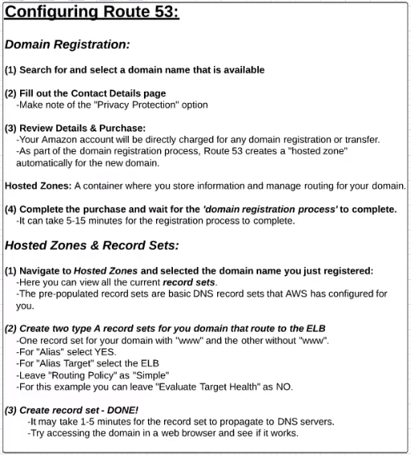

Route53 - is a highly available and scalable **Domain Name System (DNS)** web service. 

 - Domain registration
 
 - Domain Name System (DNS) service
 
 - Health checking
 
 
 
 ---
 
 Pricing
 
 Note: Free Tier use is NOT available
 
  1) Number of hosted zone
  2) Traffic flow (per Policy)
  3) Standard queries
  4) Lantency based routing
  5) Geo DNS queries and Geoproximity Queries
  6) Health checks
  7) Auto Naming
  8) Domain Names
 
  
