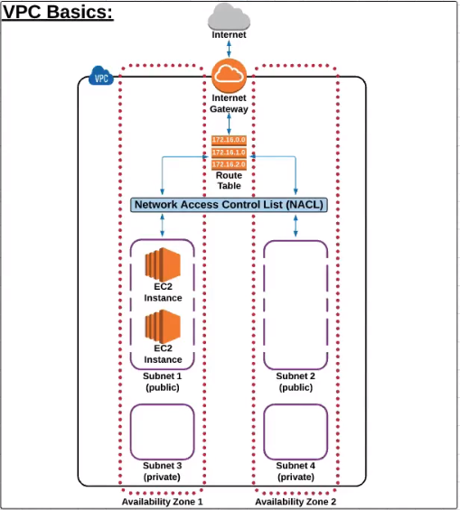
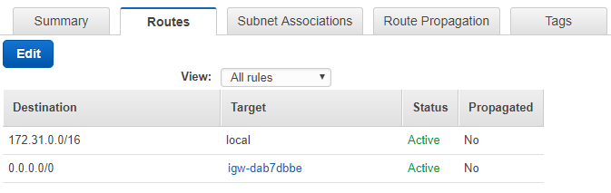

AWS Global Infrastructure 
Regions = agroup of AWS resource, comprised of multiple of AZ 
AZ Availabiliy Zones 
------
VPC Virtual Private Cloud

A default VPC including:
- IGW internet gateway
- A route table
- A network access control list
- Subnets to provision AWS resource in (e.g. EC2 instance)

------

 - IGW 
 - RouteTables 
You cannot delete RT if it has dependencies 

 - NACL Network Access Control List 
 Rules are evaluated based on "rule #" from lowest to highest
 
